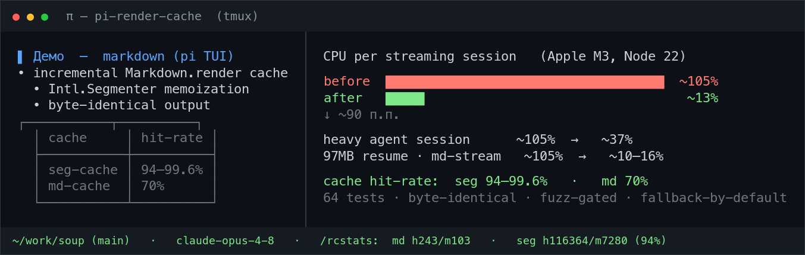

# pi-render-cache

**Reduces pi coding-agent TUI rendering work while a model streams, without changing rendered output.**

The extension applies two independent, bounded caches inside pi's process: one for repeated `Intl.Segmenter` results and one for stable prefixes of unstyled streaming Markdown. Each patch has its own compatibility and ownership state and falls back to the original implementation on unsupported input.

No pi-tui fork and no configuration are required.



---

## The problem

The relevant hot path is terminal re-rendering, not model or network work:

```
pi-tui render timer
  → Markdown.render → line wrap/truncate
    → Intl.Segmenter grapheme iteration
```

Two independent costs stack up:

1. **Repeated segmentation.** pi-tui repeatedly segments non-ASCII text while measuring, wrapping, and truncating terminal content.
2. **Cold Markdown rebuilds.** During streaming, `AssistantMessageComponent.updateContent()` clears its content container and creates a fresh `Markdown` component for every update, discarding the component's per-instance line cache.

## What it does

| Patch | Target | Effect |
|---|---|---|
| **seg-cache** | `Intl.Segmenter.prototype.segment` | Memoizes grapheme/word segmentation by locale, granularity, and input. It preserves native record shapes and `containing()` behavior, returns fresh arrays, and uses bounded retained-cost accounting. |
| **md-cache** | `Markdown.prototype.render` | Splits unstyled streaming text into a settled prefix and growing tail, caches byte-identical prefix lines by render inputs and a hardened complete-theme fingerprint, and renders only the tail again. |

The patches are installed and evaluated independently. Runtime states are `active`, `unsupported`, or `ownership-lost`; one patch failing never removes the other.

## Measurements

### Controlled replay: pi 0.84.1

The v1.1.1 release replay used Apple M3, Node 22.23.0, pi/pi-tui 0.84.1, and 20 randomized complete blocks per workload. Values are median baseline/mode speedups with paired 95% whole-block bootstrap CIs.

| Workload | seg-cache | md-cache | both |
|---|---:|---:|---:|
| Ordinary streaming Markdown | 1.51× [1.38, 1.59] | 14.88× [13.03, 16.34] | **16.42× [14.85, 18.42]** |
| Styled thinking | 1.50× [1.37, 1.58] | 0.94× [0.88, 1.00] (fallback by design) | **1.50× [1.39, 1.64]** |
| Unicode visible-width work | 2.34× [2.24, 2.58] | n/a | **2.40× [2.35, 2.52]** |

Every replay cut point was byte-identical. The sanitized evidence, memory deltas, environment, and hashes are in [`evidence/v1.1.1/summary.json`](https://github.com/axelbaumlisto/pi-render-cache/blob/v1.1.1/evidence/v1.1.1/summary.json); methodology and upstream state are in [`docs/UPSTREAM_STATUS.md`](docs/UPSTREAM_STATUS.md). From a source checkout, reproduce the release workload with `npm run premise`.

### What this does on pi 1.x: the markdown cache is off

pi 1.0 added a render cache of its own — lines kept per component and width —
and a Markdown instance already keeps the lines it last produced. So the work
this extension's markdown cache was built to remove is gone, and what remains
is its own cost.

Four live sessions (240, 98, 85 and 76 MB), each resumed, scrolled through its
history and streamed into: **222 misses, zero hits**. The host never asked for
the same text twice.

Same work, same classes a real pi loads, 6600 lines, five runs, medians:

| Patches | Median | vs none |
|---|---:|---:|
| none | 87.3 ms | — |
| segment cache | 81.3 ms | **1.07x** |
| markdown cache | 104.7 ms | 0.83x |
| both | 99.2 ms | 0.88x |

The markdown run had 240 hits out of 360 and still lost: building a key costs a
theme fingerprint probe and a hash of the whole text, which is now dearer than
the render it replaces.

So from pi 1.0 the markdown cache installs only when asked for
(`PI_RENDER_CACHE_MD=1`), and the segment cache stays on. Everything below was
measured on the pi line that still rebuilt the whole message per streamed
chunk; it does not describe 1.x.

### Live session, measured through pi itself: pi 1.0.2, 2026-10

Every number above it comes from a replay harness that imports the TUI package
and measures the patched prototype. That is a measurement of the patch, not of
pi — and it is why this extension could spend six weeks patching a copy of the
renderer that pi had stopped loading without a single check going red.

This one drives a real pi in a pty at 50x160, resuming a real 223 MB session,
and times `Markdown.prototype.render` on the module the process actually runs.
Both arms rendered byte-identical work: 180 calls over 50,485 characters.

| Arm | Run 1 | Run 2 | Per 1,000 chars |
|---|---:|---:|---:|
| Without the extension | 52.9 ms | 50.9 ms | 1.03 ms |
| With the extension | 24.8 ms | 21.0 ms | 0.46 ms |

So 2.2x on the render path of a heavy session — well short of the replay's 16x,
because that figure describes the worst case this cache was built for: a stream
arriving in small chunks, where the host re-renders the whole message per chunk.
Resuming a transcript renders each message once or twice. Both numbers are real;
they answer different questions.

`npm run verify:live` is the check that enforces the distinction — it fails when
the renderer never calls the patch.

### Earlier live-session observations: pi 0.80.7, 2026-07

These Apple M3 / Node 22.23 observations are ecological checks, not controlled benchmark evidence. Model/network timing and session content were not used for the release ratios above.

| Scenario | Baseline | With extension |
|---|---:|---:|
| Heavy agent session (subagents streaming) | ~105% of one core | ~37% |
| 97 MB resumed session, long Markdown stream (fast small chunks) | ~105% | ~10–16% |
| Same session, large-chunk model | ~105% | ~8–10% |

Live `/rcstats` observations included seg-cache hit rates of 94–99.6% and md-cache around 70% on fast, small-chunk streams. These rates depend on content and chunking and are not release gates.

### Correctness

The current deterministic suite contains **88 tests** covering byte equality, lifecycle/ownership states, cache activity, eviction and cost bounds, theme/capability/width changes, styled fallback behavior, adversarial Markdown seams, differential-canary decisions, miss-time self-verification, configuration drift, and seeded fuzz. Performance ratios are intentionally outside correctness tests.

## Install

```bash
pi install npm:pi-render-cache
```

Project-local installation (writes `.pi/settings.json`):

```bash
pi install -l npm:pi-render-cache
```

The extension loads on the next pi start. Node `>=22.19.0` is required.

## Usage

There is nothing to configure. Run:

```text
/rcstats
```

`/rcstats` reports each patch's lifecycle state and reason, live ownership, hit/miss/fallback counters, cache size and estimated retained-cost total, plus the selected pi and pi-tui versions. An `ownership-lost` result requires a restart or manual removal of the conflicting wrapper; the extension never layers another wrapper over it.

## Compatibility

Since v1.2.0 there is **no implementation-hash or pi-version allowlist**. Both patches decide support behaviorally at startup, on the real host prototypes:

- **md-cache** runs a differential canary: it temporarily installs, renders a representative Markdown corpus through both the pristine original and the patched path (miss and hit passes) with the host's live theme, and requires byte equality plus actual cache activity. Any mismatch, throw, or zero-activity outcome → `unsupported`, nothing stays patched. At runtime, sampled miss-time self-verification re-checks stitched output against a full original render and permanently falls back for a theme that ever diverges.
- **seg-cache** keeps its independent structural check (writable+configurable descriptor) and native-behavior canary.

| pi | pi-tui | Node | md-cache | seg-cache |
|---|---|---|---|---|
| 0.80.7 / 0.82.1 / 0.84.1 / 0.84.3 | locked transitive | `>=22.19.0` | active after canaries (tested units) | active after canaries |
| Other/future | resolved from selected pi | host-compatible | active when the differential canary passes byte-equal with cache activity; otherwise unsupported | evaluated independently; active only if the native Segmenter canary passes |

A future pi release that changes the Markdown renderer or theme surface therefore activates automatically when the behavioral contract still holds, and fails closed per patch when it does not — no allowlist update or extension release required. `compatibility.json` remains as a diagnostic record of tested units.

## Safety

- **Independent lifecycle.** Compatibility failure in one patch does not uninstall or misreport the other. Counters are observability only, not self-disable triggers.
- **Ownership-safe reloads.** Shared symbol state permits adoption across `/reload`; uninstall restores an original only while the extension still owns the method. Foreign wrappers produce `ownership-lost`, never wrapper layering.
- **Conservative Markdown scope.** Non-null `defaultTextStyle`, non-empty options, unsafe split boundaries, non-matching themes, throws, and oversized fingerprint outputs use the untouched original renderer.
- **Contractual theme acceptance + self-verification.** A cacheable theme must expose exactly the MarkdownTheme callback surface; every consumed output is probed twice per render (determinism) and length-framed into the cache key. Sampled cache fills are additionally byte-compared against a full original render; a theme that ever diverges is permanently blacklisted for the session. Matching callbacks must be deterministic, side-effect-free, and input-transparent — spoofed or stateful callbacks are unsupported-by-design.
- **Bounded storage.** Both caches account conservatively for retained keys and values, enforce per-entry and total limits, and skip entries that exceed them.

## Verification

The shipped compatibility diagnostic can be run from the package directory:

```bash
npm run compat
```

The benchmark engine and test fixtures are repository tooling, not included in the npm tarball. From a source checkout:

```bash
npm run verify          # 88 tests, typecheck, selected-unit compat, exact pack manifest
npm run compat:matrix   # locked pi 0.80.7, 0.82.1, and 0.84.1 fixtures
npm run premise         # full 20-block controlled replay and evaluator
npm run test:perf       # short 3-block maintainer check; not release evidence
```

## Upstream context

As checked on 2026-08-07, released pi 0.84.1 (`53fa77ccd8a279eb87e92294ef3687b03ff80112`) and newer upstream `main` (`4bf1bba203c699a0b79da669b084052c72b7a35a`) still contain both hot paths. The intervening commits do not touch the streaming assistant, Markdown renderer, or Segmenter call sites.

- [#6665](https://github.com/earendil-works/pi/issues/6665) is open, assigned, and in progress.
- [#7017](https://github.com/earendil-works/pi/pull/7017) and [#7082](https://github.com/earendil-works/pi/pull/7082) were closed without merge and address complementary outer rendering layers; neither removes both inner cache targets.
- [#6792](https://github.com/earendil-works/pi/issues/6792) was retracted by its reporter as an extension fault and is not evidence for this core issue.
- Historical reports [#4721](https://github.com/earendil-works/pi/issues/4721) and [#3758](https://github.com/earendil-works/pi/issues/3758) describe the segmentation and streaming-component rebuild profiles respectively.

See [`docs/UPSTREAM_STATUS.md`](docs/UPSTREAM_STATUS.md) for exact source links, release evidence, and the independent retirement criteria.

## Limitations

- **Styled thinking is deliberately not md-cached.** Its non-null text style forces the original Markdown renderer; this unchanged behavior is now enforced and tested. seg-cache remains active and measured about 1.5× in controlled thinking replay.
- md-cache mainly helps models that stream many small chunks. Large, infrequent chunks receive proportionally more benefit from seg-cache.
- Theme callbacks are supported only when deterministic, side-effect-free, and input-transparent. Deliberately spoofed or stateful callbacks are unsupported; the sampled miss-time differential catches divergence at the first verified fill and falls back permanently.
- Retained-cost figures are conservative estimates, not measured heap-byte guarantees. For backward compatibility, the legacy 2,000,000-unit setting is scaled to effective budgets of 8,000,000 units for md-cache and 16,000,000 for seg-cache; per-entry limits remain one quarter of each total.
- Each patch remains a stopgap and is retired independently only after a released upstream version passes the documented structural-no-work or statistical-equivalence route.

## License

MIT © 2026 Alexander Prilipko
